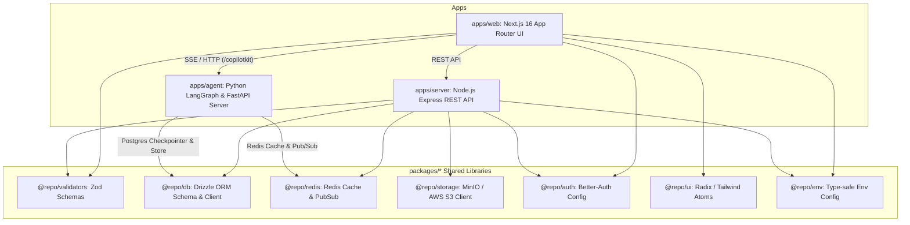

# Project Structure & Architecture Guide

This document defines the official directory layout, module boundaries, and architectural standards for the `hollow-echo-distant-signal` monorepo.

---

## 🏛️ System Architecture



---

## 1. `apps/agent` (Python 3.13 / FastAPI / LangGraph / CopilotKit)

The agent service encapsulates LangGraph deep agents, tool execution, and background worker queues.

### Directory Layout

```text
apps/agent/
├── src/
│   ├── api/                     # External HTTP & SSE Endpoints
│   │   ├── routes/
│   │   │   ├── copilotkit.py    # CopilotKit AG-UI endpoint (/copilotkit)
│   │   │   ├── events.py        # Redis Pub/Sub SSE stream (/events/{thread_id})
│   │   │   ├── health.py        # Service health checks (/health, /)
│   │   │   └── title.py         # Direct title summarization (/api/title)
│   │   ├── app.py               # FastAPI App Factory & Lifespan Management
│   │   └── __init__.py
│   ├── core/                    # Core Infrastructure & Adapters
│   │   ├── config.py            # Pydantic Settings & LLM Model Factory
│   │   ├── observability.py     # Langfuse Callback Handler
│   │   ├── redis.py             # RedisEventBroker, Redis Cache & PubSub
│   │   └── __init__.py
│   ├── graphs/                  # Domain-specific LangGraph StateGraphs
│   │   └── chat/                # Default Chat Agent
│   │       ├── graph.py         # create_deep_agent graph compilation
│   │       ├── prompts.py       # System Prompts & LCEL title prompt
│   │       └── __init__.py
│   ├── tools/                   # Agent Tools Registry
│   │   ├── system.py            # System tools (time, math, status, finalize)
│   │   └── __init__.py
│   ├── workers/                 # Background Task Queue Workers
│   │   ├── title_worker.py      # Redis Task Queue Worker (queue:title_generation)
│   │   └── __init__.py
│   ├── schemas/                 # Pydantic DTO Schemas
│   │   └── __init__.py
│   └── main.py                  # CLI and module runner entry point
├── tests/                       # Pytest Suite
│   ├── test_health.py
│   └── __init__.py
├── main.py                      # Root execution entry point (`uv run python main.py`)
├── pyproject.toml
└── Dockerfile
```

---

## 2. `apps/server` (Node.js / Express / Better-Auth / Drizzle ORM)

The server provides authentication, session management, and presigned asset storage URLs through vertical feature modules.

### Directory Layout

```text
apps/server/
├── src/
│   ├── config/                  # Server configuration (CORS, Env)
│   │   └── cors.ts
│   ├── middlewares/             # Cross-cutting Express middlewares
│   │   └── error-handler.ts     # ZodError and global exception formatting
│   ├── modules/                 # Vertical Domain Slices
│   │   ├── auth/                # Better-Auth integration
│   │   │   ├── auth.router.ts
│   │   │   └── index.ts
│   │   ├── health/              # Health check routes
│   │   │   ├── health.router.ts
│   │   │   └── index.ts
│   │   ├── sessions/            # Chat session CRUD (@repo/db)
│   │   │   ├── sessions.router.ts
│   │   │   ├── sessions.service.ts
│   │   │   └── index.ts
│   │   └── storage/             # Presigned S3/MinIO URLs (@repo/storage)
│   │       ├── storage.router.ts
│   │       └── index.ts
│   ├── app.ts                   # Express App Factory (Supertest testable)
│   ├── server.ts                # HTTP listen & Graceful Shutdown
│   └── index.ts                 # Export entry point
├── package.json
└── tsconfig.json
```

---

## 3. `apps/web` (Next.js 16 / React 19 / CopilotKit UI)

The web frontend uses Next.js 16 App Router with feature-based vertical slicing and clean client/server bundle isolation.

### Directory Layout

```text
apps/web/
├── src/
│   ├── proxy.ts                 # [Next.js 16] Official Proxy convention
│   ├── instrumentation.ts       # [Next.js 16] Server Lifecycle & OpenTelemetry hook
│   ├── app/                     # Next.js App Router (Routing Shell Only)
│   │   ├── (auth)/              # Route Group
│   │   │   └── login/
│   │   │       └── page.tsx     # Async searchParams handling
│   │   ├── dashboard/           # Workspace / Dashboard
│   │   │   └── page.tsx
│   │   ├── api/                 # API Route Handlers
│   │   │   ├── auth/[...all]/   # Better-Auth client proxy
│   │   │   ├── chat/sessions/   # Next.js BFF session routes
│   │   │   └── copilotkit/      # CopilotKit Runtime AG-UI endpoint
│   │   ├── layout.tsx           # Root Layout
│   │   └── page.tsx             # Main Playground view
│   ├── components/              # App-level Shell & Theme components
│   │   ├── app-header.tsx
│   │   ├── header.tsx
│   │   ├── loader.tsx
│   │   ├── mode-toggle.tsx
│   │   ├── providers.tsx
│   │   └── theme-provider.tsx
│   ├── features/                # Domain Feature Slices
│   │   ├── auth/                # Authentication UI & State
│   │   │   ├── components/      # sign-in-form, sign-up-form, user-menu, nav-user
│   │   │   └── index.ts
│   │   ├── chat/                # Chat domain logic & context
│   │   │   ├── context/         # chat-session-context
│   │   │   ├── lib/             # session-title
│   │   │   ├── index.ts         # Client exports (Hook & Context)
│   │   │   └── server.ts        # Server exports (Redis background runner)
│   │   └── sidebar/             # Workspace Sidebar
│   │       ├── components/      # app-sidebar
│   │       └── index.ts
│   └── lib/                     # Singletons (auth-client)
│       └── auth-client.ts
├── next.config.ts
└── package.json
```

---

## 4. Design & Extension Principles

1. **Keep Interfaces Small (Deep Modules)**: Each directory exposes its public API through `index.ts` (or `__init__.py`). Callers never import private internal sub-files.
2. **Client/Server Isolation in Next.js**: If a utility imports Node-only dependencies (e.g. `ioredis`, `@repo/redis`), expose it via `server.ts` rather than mixing it with client React hooks in `index.ts`.
3. **Shared Packages First**: Domain-agnostic schemas go into `@repo/validators`, DB queries into `@repo/db`, and UI atoms into `@repo/ui`.
