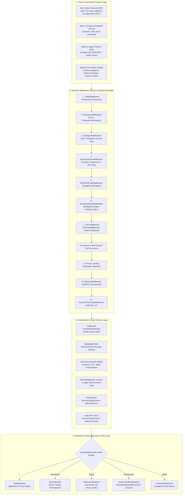
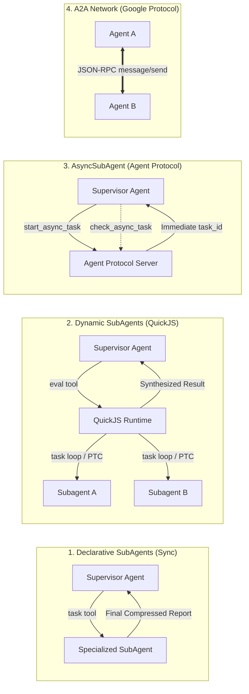
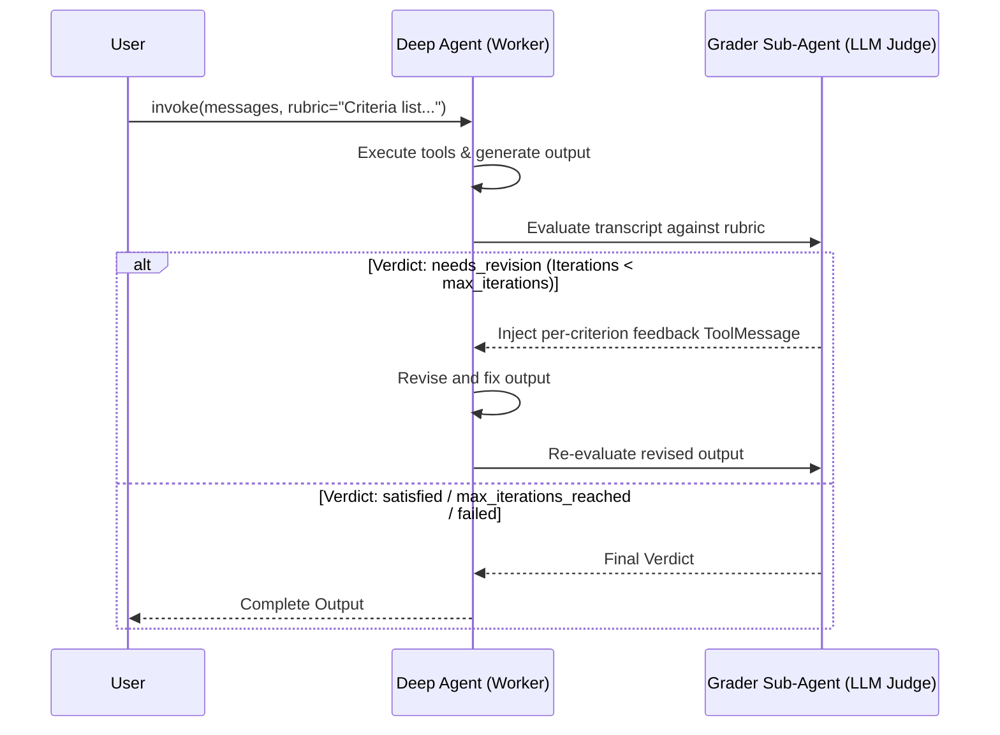
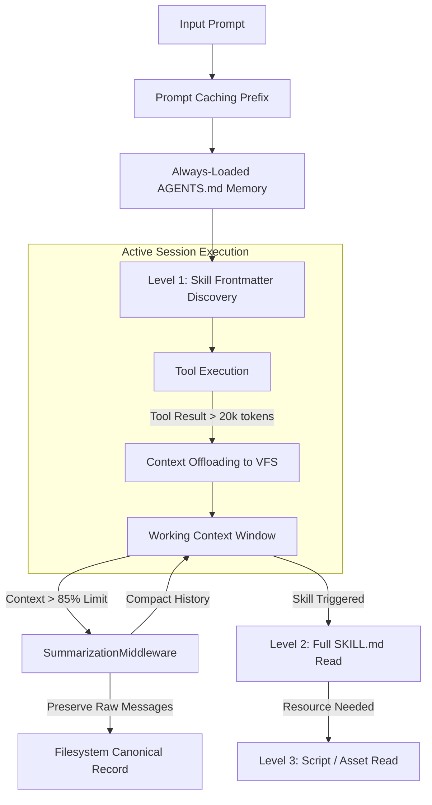
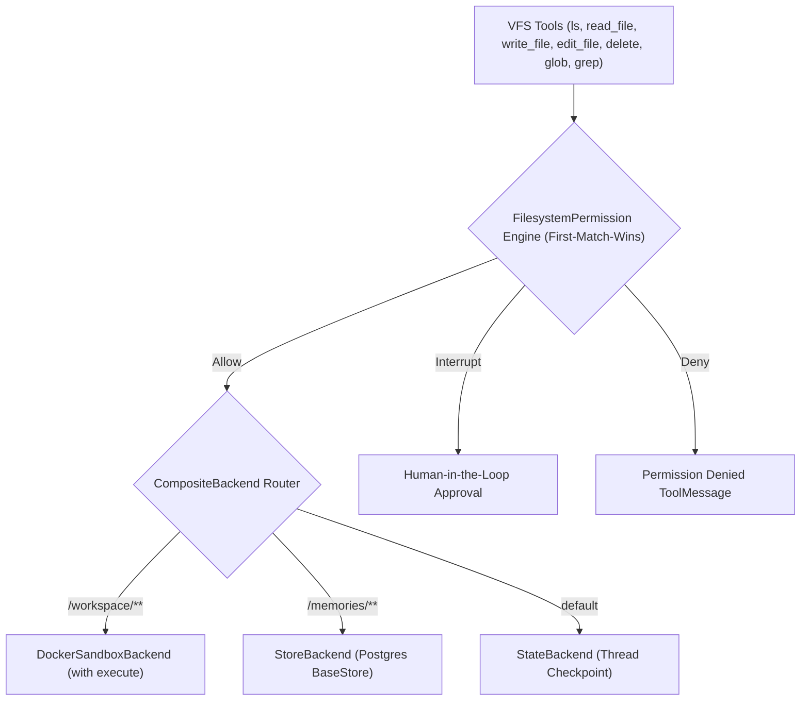

# Deep Agents Architecture & Dual-Environment Adaptation Strategy
**Local SLM (Ollama) vs. Production Cloud Multi-LLM**

---

## Executive Summary

The **LangChain Deep Agents SDK** (`deepagents>=0.7`) is a specialized agent harness built on top of LangChain and LangGraph. Rather than relying on simple iterative tool-calling loops, Deep Agents provides an enterprise-grade agent runtime with built-in virtual filesystem (VFS) abstraction, progressive context engineering, multi-tier subagent delegation, automated quality grading via LLM-as-a-judge, declarative permissions, and fault tolerance.

In real-world engineering, systems operate under two radically different execution environments:
1. **Local SLM Environment (Development/Edge/Zero-Cost)**: Powered by local small language models (e.g., Ollama running `gemma4:e4b`, `qwen2.5-coder:7b`, `llama3.2:3b`). The defining constraint is **hardware compute and VRAM contention**: concurrent parallel inferences (e.g., streaming chat while background workers or subagents run) cause local server OOMs, scheduler locks, and process crashes. Consequently, this mode requires **Single-Flight Inference serialization** and defensive feature gating.
2. **Production Cloud Multi-LLM Environment**: Powered by frontier cloud models (Anthropic Claude 3.5 Sonnet / 4.6, OpenAI GPT-4o / GPT-5.5, Google Gemini 2.5 / 3.6 Flash) with high concurrency limits, prompt caching, large context windows, containerized sandboxes, cross-thread persistent stores, and distributed async subagent swarms.

This research document provides the complete architectural blueprint of the Deep Agents stack, an exhaustive breakdown of capabilities across both environments, the concurrency mitigation strategy, and a production-grade factory implementation pattern (ADR-0022) for switching between them seamlessly.

---

## 1. Full-Stack Architectural Map of Deep Agents

Deep Agents operates as a unified 4-tier stack spanning client protocols, harness middleware pipelines, orchestration runtimes, and backend storage/execution sandboxes.



### 1.1 Layer Breakdown

#### Layer 1: Client & Interaction Protocol Layer
- **Agent Client Protocol (ACP)** (`deepagents-acp`, `AgentServerACP`): Exposes deep agents to code editors (Zed, VS Code, JetBrains) via stdio or subprocess communication using JSON-RPC. Allows editors to provide workspace context and receive real-time delta updates.
- **CopilotKit / AG-UI**: Integrates web frontends with FastAPI via `ag-ui-langgraph`'s `add_langgraph_fastapi_endpoint` and `LangGraphAGUIAgent`, wrapping the compiled graph with `CopilotKitMiddleware` for interactive chat, attachments, and state streaming.
- **Agent2Agent (A2A)**: Google's standardized protocol for inter-agent communication (`langgraph-api>=0.4.21`), exposing `/.well-known/agent-card.json` for discovery and `/a2a/{assistant_id}` for multi-turn task execution with automatic `contextId` $\leftrightarrow$ `thread_id` mapping.
- **Typed Event Streaming**: Projections (`stream.messages`, `stream.tool_calls`, `stream.subagents`, `stream.custom`) providing hierarchical, decoupled visibility into parent coordinators and child tasks without leaking internal graph nodes.

#### Layer 2: Harness Middleware Pipeline
`create_deep_agent` constructs a deterministic, fixed-order middleware stack (`docs/references/deepagents/customization.md#deep-agents-stack`). Custom middleware passed to `middleware=` is merged by `.name`: matching names replace defaults in place; novel middleware lands immediately after `PatchToolCallsMiddleware` and before prompt caching and memory.

#### Layer 3: Orchestration & State Runtime Layer
- **`create_deep_agent`**: Compiles an optimized `CompiledStateGraph` with a linear-scaling `DeltaChannel` message reducer.
- **QuickJS Interpreter**: Beta in-memory sandboxed JavaScript engine (`langchain-quickjs`) providing an `eval` tool, Programmatic Tool Calling (`tools.*`), and dynamic subagent fan-out (`task()`).
- **Rubric Grading Loop**: `RubricMiddleware` executing LLM-as-a-judge self-evaluation before returning control to the caller.
- **State & Store Split**: Checkpointers (`AsyncPostgresSaver`) preserve thread-scoped execution states; stores (`AsyncPostgresStore`) persist cross-thread memories and namespaces.

#### Layer 4: Backend & Virtual Filesystem (VFS) Layer
- Built around `BackendProtocol` (`ls`, `read`, `write`, `edit`, `delete`, `glob`, `grep`) and `SandboxBackendProtocol` (`execute`).
- **`CompositeBackend`**: Routes filesystem prefixes (`/memories/`, `/workspace/`, `/`) to distinct underlying backends.
- **`DockerSandboxBackend`**: Containerized Linux execution environment mapping thread workspaces to `/workspace/sessions/{thread_id}` with strict path denylists.

---

## 2. Capabilities Breakdown: Local SLM vs. Production Cloud Multi-LLM

| Capability Dimension | Local SLM (Ollama) | Production Cloud Multi-LLM |
| :--- | :--- | :--- |
| **Primary Models** | `ollama:gemma4:e4b-it-q4_K_M`, `ollama:qwen2.5-coder:7b`, `ollama:llama3.2:3b` | `anthropic:claude-sonnet-4-6`, `openai:gpt-5.5`, `google_genai:gemini-3.6-flash` |
| **Inference Concurrency**| **Strict Single-Flight (`Semaphore(1)`)**: Zero parallel requests; FIFO queued | **High Concurrency**: Distributed parallel subagent swarms and async tasks |
| **Title Generation** | **Heuristic Slicing (`user_prompt[:25]`)**: Zero LLM inference overhead | **Async LLM Worker**: Background summarization worker on Redis queue |
| **Harness Profile** | Custom `HarnessProfile` with aggressive `excluded_tools`, disabled default subagents, concise prompt suffix | Provider-native profiles with prompt cache tuning, structured outputs, full tool surface |
| **Subagents** | Sync subagents disabled or strictly single-purpose; no async subagents; no heavy fan-out | Full declarative subagents, dynamic QuickJS subagents (`task()`), `AsyncSubAgent` swarms |
| **Quality Assurance** | Rule-based Python validators or single-pass regex; rubric grading omitted to avoid compute exhaustion | `RubricMiddleware` with dedicated lightweight grader model (`claude-haiku-4-5`) and multi-iteration feedback |
| **Context Compression** | Early summarization (trigger at 4k–8k tokens, keep 4 messages); strict offloading | Standard summarization (trigger at 85% of 200k+ window); on-demand `compact_conversation` tool |
| **Prompt Caching** | Unsupported / No-op | Automatic prefix caching (`AnthropicPromptCachingMiddleware`, `BedrockPromptCachingMiddleware`, TTL 1h) |
| **Memory / AGENTS.md** | Minimal, single-file `AGENTS.md` injected into prompt; read-only | Multi-file `AGENTS.md`, OpenWiki repository docs, user/assistant-scoped `StoreBackend` |
| **Skills Layer** | Minimal level-1 frontmatter; max 2–3 compact skills | Deep multi-skill repository (`.agents/skills/`), 3-level progressive disclosure, supporting scripts |
| **VFS & Sandboxing** | `StateBackend` or `FilesystemBackend(virtual_mode=True)` with local process fallback | `CompositeBackend` (`StateBackend` default + `StoreBackend` + `DockerSandboxBackend` with Linux isolation) |
| **Filesystem Permissions**| Hardcoded path denylist (`.env`, `.git`, `..`) | Declarative `FilesystemPermission` rules with `mode="interrupt"` for human approval |
| **Fault Tolerance** | `ToolErrorMiddleware` with simple string errors; low `ModelCallLimitMiddleware(run_limit=15)` | `ModelRetryMiddleware`, `ToolRetryMiddleware`, `ModelFallbackMiddleware`, `InMemoryRateLimiter` |
| **Protocols** | Stdio ACP for local Zed/IDE editing; local FastAPI AG-UI | Distributed AG-UI over HTTPS/SSE; A2A Agent Server with LangSmith tracing |
| **Multimodal Handling** | Text-only or single-image base64 (model-dependent) | Full multimodal `read_file` (PDF, PNG, MP4, MP3) with backend reference offloading |

---

## 3. Deep-Dive Capability Breakdown & Mechanics

### 3.1 Model Selection & Harness Profiles (`profiles.md`, `models.md`)
Harness profiles (`HarnessProfile`, `register_harness_profile`, `HarnessProfileConfig`) configure prompt assembly, tool visibility, middleware, and subagents on a per-model or per-provider basis.

#### Local SLM Adaptation:
Small local models easily suffer from **context distraction** and **hallucinated tool schemas**. The harness profile must:
1. **Exclude heavy tools**: Strip `execute`, `delete`, `edit_file`, or unused VFS tools via `excluded_tools={"execute", "delete"}`.
2. **Disable default subagent**: Local SLMs struggle with supervisor coordination loops. Disable the auto-added `general-purpose` subagent via `general_purpose_subagent=GeneralPurposeSubagentProfile(enabled=False)`.
3. **Enforce concise prompts**: Inject `system_prompt_suffix="Respond concisely. Use tools only when necessary."`.

```python
from deepagents import GeneralPurposeSubagentProfile, HarnessProfile, register_harness_profile

register_harness_profile(
    "ollama:gemma4:e4b-it-q4_K_M",
    HarnessProfile(
        system_prompt_suffix="Be extremely concise. Do not guess parameters.",
        excluded_tools=frozenset({"execute", "delete"}),
        general_purpose_subagent=GeneralPurposeSubagentProfile(enabled=False),
    ),
)
```

#### Production Multi-LLM Adaptation:
Frontier cloud models leverage full toolkits, structured outputs, and provider profiles for connection pooling and credential derivation:

```python
from deepagents import ProviderProfile, register_provider_profile

register_provider_profile(
    "anthropic",
    ProviderProfile(init_kwargs={"temperature": 0.2, "max_tokens": 8192}),
)
```

---

### 3.2 Subagent Delegation Topologies (`subagents.md`, `dynamic-subagents.md`, `async-subagents.md`, `a2a.md`)

Deep Agents supports four subagent delegation models:



1. **Declarative SubAgents (Synchronous)**:
   - Defined via dictionaries or `CompiledSubAgent`.
   - Each invocation runs in an **isolated context window** (context quarantine), preventing massive tool logs (e.g., scraping, large grep) from polluting the supervisor's context.
   - Inherits backend and checkpointer, but has independent `system_prompt`, `tools`, `skills`, and `response_format`.
2. **Dynamic SubAgents (`dynamic-subagents.md`, `interpreters.md`)**:
   - Uses `CodeInterpreterMiddleware()` (QuickJS) to run JavaScript loops, branches, and batches.
   - Exposes `task({ description, subagentType, responseSchema })` inside JavaScript.
   - Implements **Recursive Language Models (RLM)**: variables remain in memory across `eval` turns (`mode="thread"`), allowing deterministic fan-out without repetitive LLM generation turns.
3. **Async SubAgents (`async-subagents.md`)**:
   - Uses `AsyncSubAgentMiddleware` communicating over the Agent Protocol (ASGI co-deployed or HTTP remote).
   - Provides 5 non-blocking tools: `start_async_task`, `check_async_task`, `update_async_task`, `cancel_async_task`, `list_async_tasks`.
   - Task metadata is persisted in a dedicated `async_tasks` state channel to survive context summarization.
4. **Agent-to-Agent (A2A) Protocol (`a2a.md`)**:
   - Enables distributed multi-agent mesh communication via `langgraph-api>=0.4.21`.
   - Discovers agent capabilities via `GET /.well-known/agent-card.json?assistant_id=...` and exchanges messages via JSON-RPC `message/send` or `message/stream`.

---

### 3.3 Quality Assurance: RubricMiddleware / LLM-as-a-Judge (`rubric.md`)

`RubricMiddleware` (`deepagents>=0.6.5`) introduces a runtime self-correction loop where a secondary grader model audits the agent's work against an evaluation rubric before completing execution.



- **Verdict States**: `satisfied` (pass), `needs_revision` (loops back with feedback), `max_iterations_reached` (cap reached), `failed` (malformed rubric), `grader_error` (judge runtime failure).
- **Environment Strategy**: In Local SLM, rubric loops can cause timeouts and context blowup. In Production Cloud, pair a frontier worker (`claude-sonnet-4-6`) with a fast, cheap grader (`claude-haiku-4-5` or `gemini-2.5-flash`).

---

### 3.4 Context Engineering & Progressive Disclosure (`context-engineering.md`, `skills.md`, `memory.md`)

Deep Agents manages token limits through four complementary mechanisms:



1. **Prompt Caching (`AnthropicPromptCachingMiddleware`, `BedrockPromptCachingMiddleware`)**:
   - Automatically caches static system prompts, memory, and skill indexes. `MemoryMiddleware` is placed **after** prompt caching so runtime updates do not invalidate the cache prefix.
2. **Context Offloading**:
   - Large tool inputs and outputs exceeding **20,000 tokens** are automatically written to the VFS (`/large_tool_results/`) and replaced with a file path pointer and a 10-line preview.
3. **Summarization (`SummarizationMiddleware`)**:
   - Triggers at **85% of `max_input_tokens`** (or 170k token fallback), keeping the most recent 10% (or 6 messages) verbatim.
   - Dual-write preservation: structured summary enters working memory while full raw transcript is archived to `/conversation_history/`.
   - On-demand compaction tool available via `create_summarization_tool_middleware`.
4. **Memory (`AGENTS.md`) vs. Skills (Progressive Disclosure)**:
   - **Memory (`AGENTS.md`)**: Always injected at startup. Best for high-level rules, coding style, and project conventions.
   - **Skills (`.agents/skills/`)**: 3-level progressive disclosure:
     - *Level 1 (Discovery)*: Only YAML frontmatter (`name`, `description`) is loaded into the startup system prompt.
     - *Level 2 (Instructions)*: Full `SKILL.md` body is loaded via `read_file` only when the task demands it.
     - *Level 3 (Resources)*: Supporting scripts (`scripts/`), references (`references/`), and templates (`assets/`) are read on demand.

---

### 3.5 Filesystem & Sandbox Backends (`backends.md`, `sandboxes.md`, `permissions.md`)

Deep Agents decouples file operations from the host OS via pluggable backends:



1. **`CompositeBackend` Routing**:
   - Directs `/workspace/` to sandboxes, `/memories/` to cross-thread storage, and default internal artifacts to ephemeral `StateBackend`.
2. **`StoreBackend` Namespace Factories**:
   - Multi-tenant data isolation using `Runtime` metadata:
     - User isolation: `namespace=lambda rt: (rt.server_info.user.identity,)`
     - Assistant isolation: `namespace=lambda rt: (rt.server_info.assistant_id,)`
3. **`DockerSandboxBackend` (`apps/agent/src/graphs/chat/backends.py`)**:
   - Implements `SandboxBackendProtocolV2` with thread-scoped directory binding (`/workspace/sessions/{thread_id}`).
   - Provides safe containerized `execute` with timeout enforcement, output truncation, and denylists (`.env`, `.git`, `..`).
4. **`FilesystemPermission` (`permissions.md`)**:
   - Declarative rules evaluated in first-match-wins order:
     - `operations=["read", "write"]`
     - `paths=["/workspace/**", "/secrets/**"]`
     - `mode="allow" | "deny" | "interrupt"` (`mode="interrupt"` pauses execution for HITL review).

---

### 3.6 Fault Tolerance & Resilience (`fault-tolerance.md`)

| Failure Mode | Recovery Strategy | Middleware Component |
| :--- | :--- | :--- |
| **Transient Network / 429 Rate Limits** | Exponential backoff retry | `ModelRetryMiddleware(max_retries=3, backoff_factor=2.0)` |
| **Flaky External API Tools** | Tool-specific retry | `ToolRetryMiddleware(max_retries=2, tools=["search", "fetch_url"])` |
| **Tool Execution / Format Errors** | Convert exception to `ToolMessage` | `ToolErrorMiddleware(on_error)` (allows model self-correction) |
| **Provider Complete Outage** | Transparent fallback model | `ModelFallbackMiddleware("openai:gpt-5.5")` |
| **Runaway Tool / Model Loops** | Hard limits per run or thread | `ModelCallLimitMiddleware(run_limit=50)`, `ToolCallLimitMiddleware(run_limit=200)` |
| **Provider Rate Caps** | Token bucket rate limiter | `InMemoryRateLimiter(requests_per_second=0.5)` |

---

### 3.7 Multimodal Handling (`multimodal.md`)

- **`read_file` Tool**: Natively returns standard content blocks (`image`, `video`, `audio`, `file`) for supported extensions (`.png`, `.jpg`, `.webp`, `.pdf`, `.mp4`, `.wav`, etc.).
- **Tool Outputs**: Custom tools return `[{"type": "text", ...}, {"type": "image", "url": ...}]`.
- **Compression Interaction**: Context offloading operates on text tokens only; non-text media blocks are preserved in VFS replacement messages. Summarization collapses older turns into a text description, dropping raw media blocks from active context while preserving files in storage.

---

### 3.8 Inference Concurrency & Hardware Protection (ADR-0022)

In Local SLM environments, the primary failure mode is **hardware compute starvation and VRAM exhaustion** caused by simultaneous LLM inferences. Deep Agents handles this via a **Two-Tier Concurrency Defense**:

1. **Tier 1: Functional Feature Gating**:
   - In `local_slm` mode, parallel subagent swarms (`ENABLE_SUBAGENTS=false`) and iterative rubric loops are disabled at graph construction time.
   - **Heuristic Title Strategy**: Title generation switches to zero-inference string slicing (`user_prompt[:25]`), completely eliminating background Redis worker contention with the active chat stream.
2. **Tier 2: Hardware Serialization Guard (Inference Serialization Gateway)**:
   - A global `asyncio.Semaphore(1)` in `src/core/gateway.py` serializes all incoming execution requests into a FIFO queue.
   - Even if multiple browser tabs or tools trigger LLM calls, requests are executed strictly one-at-a-time, preventing Ollama process crashes, scheduler deadlocks, or OOMs.

---

## 4. Concrete Python Implementation: Dual-Environment Factory Pattern

The following production-ready factory pattern dynamically constructs an optimal Deep Agent graph based on the active runtime environment (`local_slm` vs `cloud_provider`).

```python
"""deep_agent_factory.py

Production-ready dual-environment factory for Deep Agents.
Supports Local SLM (Ollama) and Production Cloud Multi-LLM (Claude/GPT/Gemini).
"""

from __future__ import annotations

import enum
import os
from dataclasses import dataclass
from pathlib import Path
from typing import Any

# LangChain Core & Tools
from langchain.tools import tool
from langchain_core.messages import BaseMessage
from langchain.rate_limiters import InMemoryRateLimiter

# Deep Agents Harness
from deepagents import (
    CompiledSubAgent,
    DeepAgentState,
    FilesystemPermission,
    GeneralPurposeSubagentProfile,
    HarnessProfile,
    create_deep_agent,
    register_harness_profile,
    register_provider_profile,
    ProviderProfile,
)
from deepagents.backends import CompositeBackend, FilesystemBackend, StateBackend, StoreBackend
from deepagents.middleware import FilesystemMiddleware, SummarizationMiddleware

# Middleware Suite
from langchain.agents.middleware import (
    ModelCallLimitMiddleware,
    ModelFallbackMiddleware,
    ModelRetryMiddleware,
    TodoListMiddleware,
    ToolCallLimitMiddleware,
    ToolErrorMiddleware,
    ToolRetryMiddleware,
)
from langchain_anthropic.middleware import AnthropicPromptCachingMiddleware

# Checkpointers & Stores
from langgraph.checkpoint.base import BaseCheckpointSaver
from langgraph.checkpoint.memory import MemorySaver
from langgraph.store.base import BaseStore
from langgraph.store.memory import InMemoryStore


class EnvironmentMode(str, enum.Enum):
    LOCAL_SLM = "local_slm"
    CLOUD_PROVIDER = "cloud_provider"


@dataclass
class EnvironmentConfig:
    mode: EnvironmentMode
    primary_model: str
    fallback_model: str | None = None
    enable_subagents: bool = True
    enable_sandbox: bool = False
    enable_rubric_judge: bool = False
    workspace_root: Path = Path("./workspace")
    max_model_calls: int = 30
    max_tool_calls: int = 100


def _handle_tool_error(exc: Exception, request: Any) -> str | None:
    """Surfaces recoverable errors back to the model as ToolMessages."""
    if isinstance(exc, (ValueError, FileNotFoundError, PermissionError)):
        tool_name = request.tool_call.get("name", "tool") if hasattr(request, "tool_call") else "tool"
        return f"Error executing `{tool_name}`: {type(exc).__name__} - {exc}. Please adjust arguments and retry."
    return None  # Unhandled errors propagate


class DeepAgentFactory:
    """Factory creating fully-configured Deep Agent graphs for Local SLM or Cloud Multi-LLM."""

    @staticmethod
    def create_agent(
        config: EnvironmentConfig,
        checkpointer: BaseCheckpointSaver | None = None,
        store: BaseStore | None = None,
        custom_tools: list[Any] | None = None,
        subagents: list[dict[str, Any]] | None = None,
    ) -> Any:
        tools = list(custom_tools) if custom_tools else []
        middleware_stack: list[Any] = [TodoListMiddleware()]
        config.workspace_root.mkdir(parents=True, exist_ok=True)

        # ---------------------------------------------------------
        # 1. LOCAL SLM CONFIGURATION (Ollama / Small Local Models)
        # ---------------------------------------------------------
        if config.mode == EnvironmentMode.LOCAL_SLM:
            # Register tailored profile: exclude heavy tools & disable general subagent
            register_harness_profile(
                config.primary_model,
                HarnessProfile(
                    system_prompt_suffix="Keep answers concise. Use tools only when required.",
                    excluded_tools=frozenset({"execute", "delete"}),
                    general_purpose_subagent=GeneralPurposeSubagentProfile(enabled=False),
                ),
            )

            # Lightweight VFS: Thread-scoped state with local sandboxed workspace
            backend = CompositeBackend(
                default=StateBackend(),
                routes={
                    "/workspace/": FilesystemBackend(
                        root_dir=str(config.workspace_root),
                        virtual_mode=True,
                    ),
                },
            )

            # Defensive limits and error handling for SLM stability
            middleware_stack.extend([
                ModelCallLimitMiddleware(run_limit=config.max_model_calls),
                ToolCallLimitMiddleware(run_limit=config.max_tool_calls),
                ToolErrorMiddleware(_handle_tool_error),
                # Aggressive summarization for smaller 8k-32k context windows
                SummarizationMiddleware(
                    model=config.primary_model,
                    backend=backend,
                    trigger=("tokens", 6000),
                    keep=("messages", 4),
                ),
            ])

            permissions = [
                FilesystemPermission(operations=["read", "write"], paths=["/workspace/**"], mode="allow"),
                FilesystemPermission(operations=["read", "write"], paths=["/**"], mode="deny"),
            ]

            effective_checkpointer = checkpointer or MemorySaver()
            effective_store = store or InMemoryStore()

            return create_deep_agent(
                model=config.primary_model,
                tools=tools,
                backend=backend,
                permissions=permissions,
                middleware=middleware_stack,
                subagents=subagents if config.enable_subagents else None,
                checkpointer=effective_checkpointer,
                store=effective_store,
                memory=["/workspace/AGENTS.md"] if (config.workspace_root / "AGENTS.md").exists() else None,
            )

        # ---------------------------------------------------------
        # 2. PRODUCTION CLOUD MULTI-LLM CONFIGURATION
        # ---------------------------------------------------------
        elif config.mode == EnvironmentMode.PRODUCTION_CLOUD:
            # Provider optimizations
            register_provider_profile(
                "anthropic",
                ProviderProfile(init_kwargs={"temperature": 0.1, "max_tokens": 8192}),
            )

            # Multi-tier VFS backend: State default + Store memories + Sandbox workspace
            backend = CompositeBackend(
                default=StateBackend(),
                routes={
                    "/memories/": StoreBackend(
                        namespace=lambda rt: (getattr(rt.server_info.user, "identity", "anonymous"), "memories"),
                    ),
                    "/workspace/": FilesystemBackend(
                        root_dir=str(config.workspace_root),
                        virtual_mode=True,
                    ),
                },
            )

            # Production fault tolerance & caching
            rate_limiter = InMemoryRateLimiter(requests_per_second=2.0, max_bucket_size=10)
            middleware_stack.extend([
                ModelRetryMiddleware(max_retries=3, backoff_factor=2.0, initial_delay=1.0),
                ToolRetryMiddleware(max_retries=2, retry_on=(TimeoutError, ConnectionError)),
                ToolErrorMiddleware(_handle_tool_error),
                ModelCallLimitMiddleware(run_limit=config.max_model_calls),
                ToolCallLimitMiddleware(run_limit=config.max_tool_calls),
                AnthropicPromptCachingMiddleware(ttl="1h"),
            ])

            if config.fallback_model:
                middleware_stack.append(ModelFallbackMiddleware(config.fallback_model))

            # Strict production permissions with Human-In-The-Loop approval for sensitive paths
            permissions = [
                FilesystemPermission(operations=["read", "write"], paths=["/workspace/.env*", "/workspace/.git/**"], mode="deny"),
                FilesystemPermission(operations=["write"], paths=["/workspace/critical/**"], mode="interrupt"),
                FilesystemPermission(operations=["read", "write"], paths=["/workspace/**", "/memories/**"], mode="allow"),
                FilesystemPermission(operations=["read", "write"], paths=["/**"], mode="deny"),
            ]

            # Production declarative subagents
            prod_subagents: list[Any] = subagents or [
                {
                    "name": "deep-researcher",
                    "description": "Performs deep web research and evidence synthesis.",
                    "system_prompt": "You are an expert research analyst. Gather evidence and summarize findings.",
                    "model": "google_genai:gemini-3.6-flash",
                    "tools": tools,
                },
                {
                    "name": "code-reviewer",
                    "description": "Audits code for security vulnerabilities and style adherence.",
                    "system_prompt": "You are a principal security engineer. Audit code with line numbers and severity.",
                    "model": "anthropic:claude-sonnet-4-6",
                    "tools": tools,
                },
            ]

            return create_deep_agent(
                model=config.primary_model,
                tools=tools,
                backend=backend,
                permissions=permissions,
                middleware=middleware_stack,
                subagents=prod_subagents if config.enable_subagents else None,
                checkpointer=checkpointer or MemorySaver(),
                store=store or InMemoryStore(),
                skills=["./.agents/skills/"] if Path("./.agents/skills/").exists() else None,
                memory=["./AGENTS.md"] if Path("./AGENTS.md").exists() else None,
            )

        raise ValueError(f"Unknown EnvironmentMode: {config.mode}")
```

---

## 5. Primary Source Citations & Repository Mapping

| Deep Agents Feature / Concept | Reference Primary Source | Repository Implementation File |
| :--- | :--- | :--- |
| **Agent Harness Overview & Architecture** | `docs/references/deepagents/overview.md` | `apps/agent/src/graphs/chat/graph.py` |
| **Middleware Pipeline & Ordering** | `docs/references/deepagents/customization.md#deep-agents-stack` | `apps/agent/src/graphs/chat/graph.py` |
| **Harness & Provider Profiles** | `docs/references/deepagents/profiles.md` | `apps/agent/src/core/config.py` |
| **Filesystem Backends & Routing** | `docs/references/deepagents/backends.md` | `apps/agent/src/graphs/chat/backends.py` |
| **Docker Sandbox Execution (`execute`)** | `docs/references/deepagents/sandboxes.md` | `apps/agent/src/graphs/chat/backends.py:L50-263` |
| **Declarative Filesystem Permissions** | `docs/references/deepagents/permissions.md` | `apps/agent/src/graphs/chat/backends.py:L41-47` |
| **Synchronous Subagent Delegation** | `docs/references/deepagents/subagents.md` | `apps/agent/src/graphs/chat/subagents.py` |
| **Dynamic Subagents & QuickJS Runtime** | `docs/references/deepagents/dynamic-subagents.md`, `interpreters.md` | N/A (Candidate Extension) |
| **Async Subagents & Agent Protocol** | `docs/references/deepagents/async-subagents.md` | `apps/agent/src/workers/title_worker.py` (Async Task Pattern) |
| **A2A Inter-Agent Protocol** | `docs/references/deepagents/a2a.md` | N/A (Candidate Protocol Bridge) |
| **Rubric Quality Assurance (LLM Judge)** | `docs/references/deepagents/rubric.md` | N/A (Candidate Middleware) |
| **Context Compression & Summarization** | `docs/references/deepagents/context-engineering.md` | `apps/agent/src/core/gateway.py` |
| **Progressive Skills & AGENTS.md Memory** | `docs/references/deepagents/skills.md`, `memory.md` | `AGENTS.md`, `.agents/skills/` |
| **Fault Tolerance, Retries & Fallbacks** | `docs/references/deepagents/fault-tolerance.md` | `apps/agent/src/core/gateway.py` |
| **Multimodal Attachment Pipeline** | `docs/references/deepagents/multimodal.md` | `apps/agent/src/core/gateway.py:L33-120` |
| **Event Streaming Projections** | `docs/references/deepagents/event-streaming.md` | `apps/agent/src/schemas/events.py`, `gateway.py` |
| **Agent Client Protocol (ACP)** | `docs/references/deepagents/acp.md` | N/A (IDE Interop Extension) |
